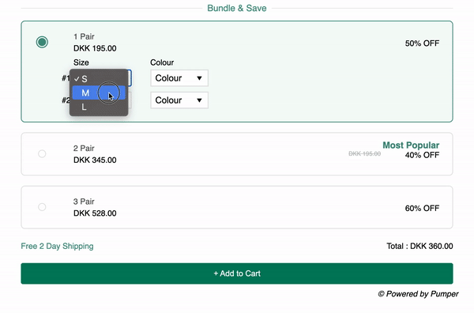

# Bundle & Save Product Options Web Page



## Overview

Bundle & Save is a simple web page that allows users to select different pairs of products and add them to the cart. Users can choose from various options like pair quantity, size, and color for each product. The web page provides discounts on different product bundles, making it an attractive offer for users.

## Live Demo

You can check out the live demo of the project [here](https://garimarajput748.github.io/proveway-task/)

## Features

- User-friendly interface for selecting product options.
- Dynamic display of product options based on the selected radio button.
- Responsive design for optimal viewing across various devices.

## How to Use

1. Clone the repository to your local machine using the following command:

```
git clone https://github.com/garimarajput748/proveway-task.git
```

2. Open the index.html file in your web browser to view the web page.

3. Explore the different product options and add items to the cart.

## Contributing

Contributions are welcome! If you find any issues or have suggestions for improvements, feel free to open an issue or submit a pull request.

## Technologies Used

- HTML
- CSS
- JavaScript


## HTML Structure

The HTML code consists of a form containing three product options, each represented by a card element. Each card represents a different bundle size, and when a user selects a bundle, the corresponding size and color options are displayed.

## JavaScript Function

The JavaScript function `showOption(radio)` is responsible for handling the visibility of the product options based on the selected bundle. When a radio button is clicked (representing the bundle selection), the function is triggered, and it hides all product options and then shows the relevant product options for the selected bundle.

## Usage

1. To use this code, you need to create an HTML file and paste the provided code into it.
2. Save the code as `index.html` or any other appropriate name.
3. Create a `style.css` file in the same directory to define the necessary CSS styles for the layout.
4. Create a `main.js` file in the same directory to contain the JavaScript function `showOption(radio)`.

## Note

This README assumes that you already have the necessary `style.css` and `main.js` files in the same directory as the HTML file. If not, make sure to create those files and define the required styles and JavaScript function.

Enjoy using the "Bundle & Save" product selection feature in your web application!

## License

This project is licensed under the MIT License.
